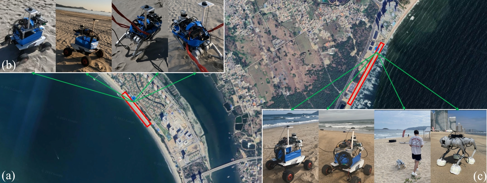
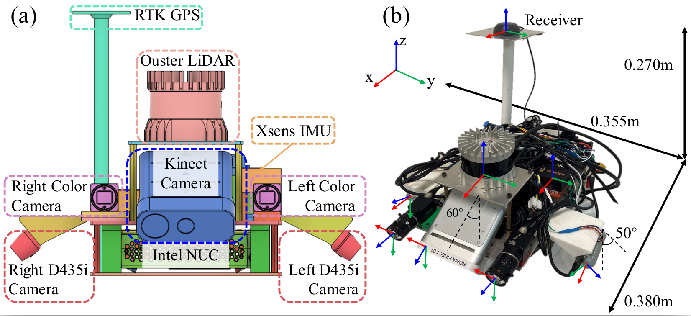
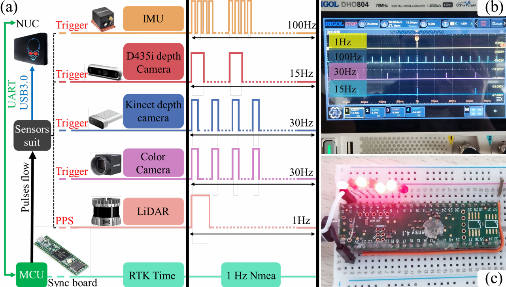

# TAIL-Platforms

## Models
<div align="center">


</div>


The CAD and urdf models of the robot platforms and the sensor suite we used in [TAIL](https://tailrobot.github.io/) dataset are provided here.

``models/wheeled/CAD/wheeled.SLDASM``: assembly of the wheeled platform

``models/quadruped/CAD/quadruped.SLDASM``: assembly of the quadruped platform


Robot platforms: ScoutMini & Unitree-GO1.  
The sensors include:   
 • 1 × LiDAR: Ouster OS0-128  
 • 3 × downward RGB-D camera: one Azure Kinect DK and two Realsense D435i cameras  
 • 2 × global-shutter color camera: two HKVision MV-CA013-A0UC cameras + MVL-HF0824M-10MP lenses  
 • 1 × RTK-GPS device: Ublox ZED-F9P   
 • 1 × extra IMU: Xsens MTi-680G


## Time synchronization

The overview of hardware time synchronization process is shown below.

<div align="center">

</div>


##
We would appreciate it if you use our dataset and cite our [paper]()：
```
@article{tail2023yao,
  title={TAIL: A Terrain-Aware Multi-Model Dataset for Robust SLAM in Deformable, Granular Environment},
  author={Yao, Chen and Ge, Yangtao and Shi, Guowei and Wang, Zirui and Yang, Ningbo and Zhu, zheng and Wei, Hexiang and Zhao, Yuntian and Wu, Jing and Jia, Zhenzhong},
  year={2023},
  url={https://tailrobot.github.io/}
}
```